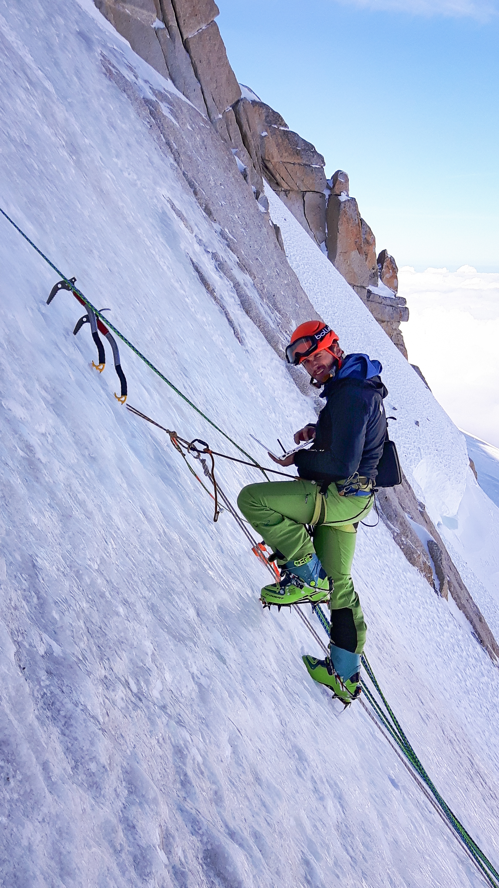

<h2>Recent Posts</h2>
<!--
<a href="#" class="post-item">
  Jun 18, 2025
  Global Detection of Glacier Surges (2000–2024)
</a>
<!--
<a href="#" class="post-item">
  Dec 05, 2023
  Bayesian Estimation of Glacier Elevation Changes
</a>

---

# Greg Guillet

I am a researcher at the University of Oslo within the [Department of Geosciences](https://www.mn.uio.no/geo/english/). My research focuses on modeling cryospheric processes using Bayesian methods, data assimilation, and machine learning. I work at the interface between models and observations, developing approaches that improve our understanding of snow and ice dynamics while rigorously quantifying the uncertainties involved. My applications range from natural hazards such as snow avalanches and glacier modeling to the assessment of water resource availability.

Before joining UiO, I was a postdoctoral research fellow in Civil and Environmental Engineering at the University of Washington, where I worked within the [UW Cryosphere group](https://uw-cryo.github.io/) on uncertainty estimation methods for studying glacier dynamics, with a focus on fast-flowing and surge-type glaciers. I hold a Ph.D. in Earth Sciences from the Université Savoie-Mont Blanc (France) and an M.Sc. in Environmental Geophysics from the Université Grenoble-Alpes.

## Research Interests

  Cryospheric Modeling
  Bayesian Methods
  Data Assimilation
  Machine Learning
  Uncertainty Quantification
  Snow Avalanches
  Glacier Dynamics
  Water Resources

<a href="mailto:gregoirg@geo.uio.no" class="contact-link">gregoirg@geo.uio.no</a>
